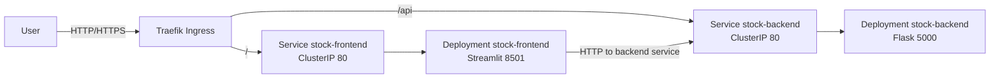

# Stock App - Cloud Deployment (Kubernetes) Aufgabe 3

Diese Dokumentation erfüllt die Abgabevorgabe: **Installationsschritte, Containerisierung, Kubernetes (Deployment, Service, Ingress), Versionierung, Skalierung (HPA)**.

- **Backend:** Flask auf Port **5000** (`mdotloading/stock-backend:vX`, verwendet: v5, v6)
- **Frontend:** Streamlit auf Port **8501** (`mdotloading/stock-frontend:vX`, verwendet: v5, v6)
- **Ingress:** Traefik (`web`, `websecure`)

## Inhalt
- [0) Voraussetzungen](#0-voraussetzungen)
- [1) Containerisierung und Infrastrukturerstellung](#1-infrastrukturerstellung-terraform)
- [2) Kubernetes-Konfiguration](#2-kubernetes-konfiguration)
- [3) Versionierung (Image-Tags & Rollouts)](#3-versionierung-image-tags--rollouts)
- [4) Skalierung (HPA) & Lasttest](#4-skalierung-hpa--lasttest)

---

## Zielsetzung & Architektur

**Zielsetzung:**  
Bereitstellung einer zweistufigen Stock-App (Flask-API + Streamlit-UI) auf Kubernetes mit reproduzierbarer Containerisierung, externem Routing via Traefik, Versionierung/Updates via Image-Tags in YAML und automatischer Skalierung (HPA). Messbarer Nachweis: Lasttest → HPA skaliert zwischen 2 und (in der Demo) bis 8 Pods.

**Architekturüberblick:**


---

## 0) Voraussetzungen

- Zugriff auf **OpenStack** und SSH-Keypair (z. B. `~/.ssh/id_ed25519`)
- Zugriff auf **Docker Hub** (Images unter Benutzer `mdotloading`)
- **Optional:** Lokales `kubectl` mit `KUBECONFIG` für den Cluster

---

## 1) Containerisierung und Infrastrukturerstellung (Terraform)

### Frontend `code/frontend/Dockerfile`
```dockerfile
FROM python:3.13-slim
WORKDIR /app
COPY requirements.txt ./
RUN pip install -r requirements.txt
COPY . .
EXPOSE 8501
CMD ["streamlit", "run", "app.py", "--server.address=0.0.0.0", "--server.port=8501"]
```

### Backend `code/backend/Dockerfile`
```dockerfile
FROM python:3.13-slim
WORKDIR /app
COPY requirements.txt ./
RUN pip install -r requirements.txt
COPY . .
ENV PORT=5000
EXPOSE 5000
CMD ["python", "backend.py"]
```

### 1.3 Images bauen & pushen
> Voraussetzung: `docker login`
```bash
# Backend bauen & pushen
docker build -t mdotloading/stock-backend:v1 ./code/backend   # Tags anpassen (z. B. v5, v6)
docker push mdotloading/stock-backend:v1

# Frontend bauen & pushen
docker build -t mdotloading/stock-frontend:v1 ./code/frontend # Tags anpassen (z. B. v5, v6)
docker push mdotloading/stock-frontend:v1
```

### 1.4 Infrastrukturerstellung mit Terraform (kurz)

**Provider Block leer, zum ausführen der Befehle vorher die openrc.sh file von OpenStack sourcen:**
```bash
source path/to/openrc.sh
```

**Erstellt werden:**
- 1× **Master-VM** und 2× **Worker-VMs** (Ubuntu) für den K3s-Cluster
- **Floating IP(s)** für externe Erreichbarkeit
- **Security Group** 

```bash
terraform init
terraform plan
terraform apply -auto-approve
```

**Verbindung nach Erstellung (optional):**
```bash
ssh -i ~/.ssh/<dein_key> ubuntu@<MASTER_IP>
```
---

**SCP: Übertragen des k8s Ordner auf Master (optional)**  

```bash
# Ordner 'k8s' komplett auf den Master, Vorraussetzung ist hier, dass wir uns im Projektordner befinden sonst muss statt "k8s" der komplette bzw. relative Pfad zum k8s Folder angegeben werden
scp -i ~/path/to/your/key -r k8s ubuntu@<MASTER_IP>:/home/ubuntu/
```
**Alternativ kubeconfig in lokaler shell aktivieren und so bspw. aus der Ubuntu Shell in WSL arbeiten:**
```bash
export KUBECONFIG=$(pwd)/k3s.yaml
```

---

### 1.5 Post-Provisioning: Master tainten & Worker labeln
_Ziel: Workloads nicht auf dem Master; Deployments mit `nodeSelector: nodepool=worker` laufen gezielt auf Workern._
```bash
kubectl get nodes -o wide
kubectl taint nodes k3s-master-mdot node-role.kubernetes.io/control-plane=:NoSchedule --overwrite || \
kubectl taint nodes k3s-master-mdot node-role.kubernetes.io/master=:NoSchedule --overwrite
kubectl label nodes k3s-worker-0 nodepool=worker --overwrite
kubectl label nodes k3s-worker-1 nodepool=worker --overwrite
kubectl get nodes --show-labels
```

---

## 2) Kubernetes-Konfiguration

### 2.1 Namespace - `k8s/namespace.yaml`
**Funktion:** Legt den Namespace `stock-app` an, um Ressourcen zu isolieren.  
<details>
<summary>Code anzeigen</summary>

```yaml
apiVersion: v1
kind: Namespace
metadata:
  name: stock-app
```
</details>

---

### 2.2 Backend - Deployment - `k8s/deployment-backend.yaml`
**Funktion:** Startet 2 Replikas der Flask-API, verteilt sie über Nodes (Anti-Affinity/Spread), nutzt TCP-Probes und Ressourcen-Requests/Limits.  
<details>
<summary>Code anzeigen</summary>

```yaml
apiVersion: apps/v1                          # Stable API für Deployments
kind: Deployment
metadata:
  name: stock-backend
  namespace: stock-app
  labels: { app: stock-backend }
spec:
  replicas: 2                                # Grundlast; HPA skaliert von hier aus hoch
  selector:
    matchLabels: { app: stock-backend }      # Muss zu template.labels passen
  strategy:
    type: RollingUpdate
    rollingUpdate:
      maxSurge: 1                            # +1 Pod während Update
      maxUnavailable: 0                      # 0 Ausfälle → Zero-Downtime
  template:
    metadata:
      labels:
        app: stock-backend
        version: "v6"                        # Version-Label für Observability/Rollouts
    spec:
      nodeSelector:
        nodepool: worker                     # Nur auf Worker (siehe Labeling)
      # Verhindert Co-Lokation gleicher App → bessere Resilienz
      affinity:
        podAntiAffinity:
          preferredDuringSchedulingIgnoredDuringExecution:
            - weight: 100
              podAffinityTerm:
                labelSelector:
                  matchLabels: { app: stock-backend }
                topologyKey: kubernetes.io/hostname
      # Gleichmäßige Verteilung über Nodes (wenn möglich)
      topologySpreadConstraints:
        - maxSkew: 1
          topologyKey: kubernetes.io/hostname
          whenUnsatisfiable: ScheduleAnyway
          labelSelector:
            matchLabels: { app: stock-backend }
      containers:
        - name: backend
          image: mdotloading/stock-backend:v6 # Kein :latest → reproduzierbare Rollouts
          imagePullPolicy: IfNotPresent
          ports: [ { containerPort: 5000 } ]
          # TCP-Probes, da kein /healthz
          readinessProbe:
            tcpSocket: { port: 5000 }
            initialDelaySeconds: 5
            periodSeconds: 5
          livenessProbe:
            tcpSocket: { port: 5000 }
            initialDelaySeconds: 10
            periodSeconds: 10
          resources:
            requests: { memory: "300Mi", cpu: "200m" }
            limits:   { memory: "800Mi", cpu: "1000m" }
```
</details>

---

### 2.3 Backend - Service - `k8s/service-backend.yaml`
**Funktion:** Stellt das Backend intern unter Port 80 bereit; leitet auf Container-Port 5000.  
<details>
<summary>Code anzeigen</summary>

```yaml
apiVersion: v1
kind: Service
metadata:
  name: stock-backend
  namespace: stock-app
spec:
  selector: { app: stock-backend }
  ports:
  - name: http
    protocol: TCP
    port: 80
    targetPort: 5000
  type: ClusterIP
```
</details>

---

### 2.4 Frontend - Deployment - `k8s/deployment-frontend.yaml`
**Funktion:** Startet die Streamlit-UI; `BACKEND_URL` zeigt auf den internen Service; TCP-Probes auf Port 8501.  
<details>
<summary>Code anzeigen</summary>

```yaml
apiVersion: apps/v1
kind: Deployment
metadata:
  name: stock-frontend
  namespace: stock-app
  labels:
    app: stock-frontend
spec:
  replicas: 2
  strategy:
    type: RollingUpdate
    rollingUpdate: { maxSurge: 1, maxUnavailable: 0 }
  selector:
    matchLabels: { app: stock-frontend }
  template:
    metadata:
      labels:
        app: stock-frontend
        version: "v5"
    spec:
      nodeSelector:                          
        nodepool: worker
      affinity:
        podAntiAffinity:
          preferredDuringSchedulingIgnoredDuringExecution:
            - weight: 100
              podAffinityTerm:
                labelSelector:
                  matchLabels: { app: stock-frontend }
                topologyKey: kubernetes.io/hostname
      topologySpreadConstraints:
        - maxSkew: 1
          topologyKey: kubernetes.io/hostname
          whenUnsatisfiable: ScheduleAnyway
          labelSelector:
            matchLabels: { app: stock-frontend }                
      containers:
        - name: frontend
          image: mdotloading/stock-frontend:v5
          imagePullPolicy: Always
          ports:
            - containerPort: 8501
          env:
            - { name: BACKEND_URL, value: "http://stock-backend" }
            - { name: STREAMLIT_SERVER_PORT, value: "8501" }
            - { name: STREAMLIT_SERVER_ADDRESS, value: "0.0.0.0" }
          readinessProbe:
            httpGet: { path: /_stcore/health, port: 8501 }
            initialDelaySeconds: 5
            periodSeconds: 5
          livenessProbe:
            httpGet: { path: /_stcore/health, port: 8501 }
            initialDelaySeconds: 30
            periodSeconds: 10
          resources:
            requests: { cpu: "200m", memory: "256Mi" }
            limits:   { cpu: "500m", memory: "512Mi" }
```
</details>

---

### 2.5 Frontend - Service - `k8s/service-frontend.yaml`
**Funktion:** Stellt das Frontend intern unter Port 80 bereit; leitet auf Container-Port 8501.  
<details>
<summary>Code anzeigen</summary>

```yaml
apiVersion: v1
kind: Service
metadata:
  name: stock-frontend
  namespace: stock-app
spec:
  selector: { app: stock-frontend }
  ports:
  - name: http
    protocol: TCP
    port: 80
    targetPort: 8501
  type: ClusterIP
```
</details>

---

### 2.6 Ingress (Traefik) - `k8s/ingress.yaml`
**Funktion:** Externes Routing: `/` → Frontend, `/api` → Backend. Nutzung der Traefik-EntryPoints `web`/`websecure`.  Externe Erreichbarkeit außerhalb des Clusters wird gewährleistet.
<details>
<summary>Code anzeigen</summary>

```yaml
apiVersion: networking.k8s.io/v1
kind: Ingress
metadata:
  name: stock-app
  namespace: stock-app
  annotations:
    kubernetes.io/ingress.class: traefik               # Klassische Annotation
    traefik.ingress.kubernetes.io/router.entrypoints: web,websecure  # 80/443
spec:
  ingressClassName: traefik
  rules:
  - http:
      paths:
      - path: /
        pathType: Prefix
        backend:
          service: { name: stock-frontend, port: { number: 80 } }
      - path: /api
        pathType: Prefix
        backend:
          service: { name: stock-backend, port: { number: 80 } }

```
</details>

---

### 2.7 Apply & Checks (gesamt)
```bash
kubectl apply -f k8s/namespace.yaml
kubectl apply -f k8s/deployment-backend.yaml
kubectl apply -f k8s/service-backend.yaml
kubectl apply -f k8s/deployment-frontend.yaml
kubectl apply -f k8s/service-frontend.yaml
kubectl apply -f k8s/ingress.yaml

kubectl -n stock-app get deploy,pod -l app=stock-backend
kubectl -n stock-app get deploy,po,svc,ingress
kubectl -n stock-app rollout status deploy/stock-backend
kubectl -n stock-app rollout status deploy/stock-frontend
```

---

## 3) Versionierung (Image-Tags & Rollouts)

**Neues Image bauen & pushen (Beispiel: Frontend v5)**
```bash
docker build -t mdotloading/stock-frontend:v5 ./frontend
docker push mdotloading/stock-frontend:v5
```

**Deployment auf neuen Tag setzen (ohne YAML zu editieren)**
```bash
kubectl -n stock-app set image deploy/stock-frontend frontend=mdotloading/stock-frontend:v5
kubectl -n stock-app rollout status deploy/stock-frontend
```

**Alternative: YAML anpassen & apply**  
(Ändere **genau** Image-Tag und das `version`-Label. )
<details>
<summary>Diff anzeigen</summary>

```yaml
# k8s/deploy-frontend.yaml (Ausschnitt)
spec:
  template:
    metadata:
      labels:
        app: stock-frontend
        version: "v5"                # <— Version-Label anpassen
    spec:
      containers:
      - name: frontend
        image: mdotloading/stock-frontend:v5   # <— Image-Tag anpassen
```
</details>

```bash
kubectl scp -i ~/path/to/your/key -r path/to/k8s/deployment-frontend.yaml ubuntu@Master-IP:/home/ubuntu/k8s/deployment-frontend.yaml # sorgt dafür, dass die aktualisierte Version auf den Cluster geladen wird bevor der nächste Apply-Befehl ausgeführt wird
kubectl apply -f k8s/deployment-frontend.yaml
kubectl -n stock-app rollout status deploy/stock-frontend
```

**Rollback**
```bash
kubectl -n stock-app rollout undo deploy/stock-frontend
kubectl -n stock-app rollout history deploy/stock-frontend
```

---

## 4) Skalierung (HPA) & Lasttest

### 4.1 Backend HPA — `k8s/hpa-backend.yaml`
**Funktion:** Skaliert `stock-backend` zwischen 2–8 Replikas basierend auf CPU-Auslastung (~50 % Ziel). Diese Werte lassen sich jedoch nach belieben modifizieren.
<details>
<summary>Code anzeigen</summary>

```yaml
apiVersion: autoscaling/v2
kind: HorizontalPodAutoscaler
metadata:
  name: stock-backend-hpa
  namespace: stock-app
spec:
  scaleTargetRef:                                  # Zielobjekt: Deployment backend
    apiVersion: apps/v1
    kind: Deployment
    name: stock-backend
  minReplicas: 2                                   # Nie unter 2 (Baseline/HA)
  maxReplicas: 8                                   # Deckel gegen unkontrolliertes Hochskalieren
  metrics:
    - type: Resource
      resource:
        name: cpu
        target:
          type: Utilization
          averageUtilization: 50                   # Ziel: ~50 % CPU pro Pod
  behavior:
    # Schnell hoch (snappy), vorsichtig runter (stabil)
    scaleUp:
      stabilizationWindowSeconds: 10
      selectPolicy: Max
      policies:
        - type: Percent
          value: 200                               # Bis zu +200 % pro 30s
          periodSeconds: 30
        - type: Pods
          value: 4                                 # Oder maximal +4 Pods pro 30s
          periodSeconds: 30
    scaleDown:
      stabilizationWindowSeconds: 30
      policies:
        - type: Percent
          value: 50                                # Max. -50 % pro 30s
          periodSeconds: 30
      selectPolicy: Max
# Hinweis: HPA benötigt Metrics. In K3s ist metrics-server integriert; auf "vollen" Clustern ggf. separat deployen.
```
</details>

**Apply & prüfen**
```bash
kubectl apply -f k8s/hpa-backend.yaml
kubectl -n stock-app get hpa
```

### 4.2 Lasttest (curl-Job) — `k8s/loadgen-curl.yaml`
**Funktion:** Erzeugt hohe parallele Last auf dem Backend-Endpoint, um HPA-Scaling zu triggern.  
<details>
<summary>Code anzeigen</summary>

```yaml
apiVersion: batch/v1
kind: Job
metadata:
  name: loadgen-curl
  namespace: stock-app
spec:
  ttlSecondsAfterFinished: 300
  backoffLimit: 0
  template:
    spec:
      restartPolicy: Never
      containers:
      - name: curlbomb
        image: curlimages/curl:8.10.1
        command: ["sh","-lc"]
        args:
          - >
            URL="http://stock-backend.stock-app.svc.cluster.local/api/stock?ticker=NVDA&start=2010-01-01&end=2025-08-01";
            for i in $(seq 1 120); do
              seq 1 200 | xargs -n1 -P 200 -I{} curl -sS "$URL" >/dev/null;
            done;
            echo DONE; sleep 3

```
</details>

**Apply & beobachten**
```bash
kubectl apply -f k8s/loadgen-curl.yaml
kubectl -n stock-app logs -l job-name=loadgen-curl -f
kubectl -n stock-app get deploy/stock-backend
kubectl -n stock-app get hpa
```

**In einem zweiten Fenster lässt sich mit folgendem Befehl der Load Test nachvollziehen:**
```bash
NS=stock-app
watch -n 10 'echo === HPA ===; kubectl -n $NS get hpa; \
echo; echo === DEP ===; kubectl -n $NS get deploy; \
echo; echo === PODS ===; kubectl -n $NS get pods -o wide; \
echo; echo === TOP ===; kubectl -n $NS top pods
```